# 🎓 Capstone Project

## Table of Contents

- [Scope of the Project](#scope-of-the-project)
    -  [Data Source](#data-source)
    -  [Use Cases](#use-cases)
    -  [Tech Stack](#tech-stack)
- [The Pipeline](#the-pipeline)
  - [Airflow](#airflow)
     - [Data collection with Python scripts](#data-collection-with-python-scripts)
     - [Data transformation with DBT in BigQuery](#data-transformation-with-dbt-in-bigquery)
          - [Staging Models](#staging-models)
          - [Intermediate Models](#intermediate-models)
          - [Mart models](#mart-models)
     - [Data tests with DBT](#data-tests-with-dbt)
  - [Visualization in Looker](#visualization-in-looker)
- [Alternatives and Scaling Opportunities](#alternatives-and-scaling-opportunities)
- [What's next?](#whats-next)
- [Conclusion](#conclusion)

##
The goal of this project was to develop an automated, reliable, and scalable data pipeline that integrates data from two distinct sources—Chatfuel and Mailchimp—into a centralized data warehouse. The data is then transformed, cleaned, and subjected to quality checks before being used to generate a **daily updated** dashboard on Looker. This pipeline provides actionable insights for a small nonprofit media focused on promoting renewable energy sources in the US.

Due to various issues with Chatfuel, I decided to exclude Mailchimp for now. These issues will be explained in the “Data Source” part.
##

## Scope of the Project

### Data Source

**Chatfuel:** A no-code platform used for building Facebook Messenger bots to send weekly content and interact with subscribers. 

Chatfuel provides a visual interface for filtering user base attributes, but it is very slow and makes thorough analysis difficult. 

An example of this visual interface.    

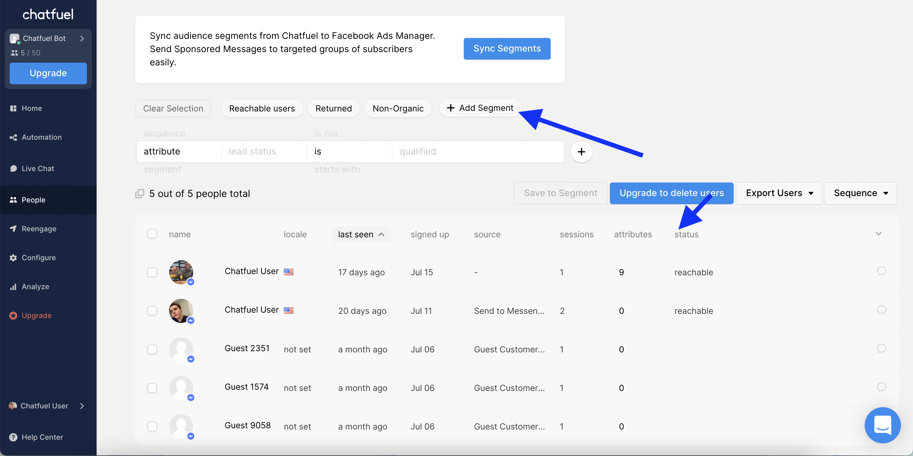
[source of the image](https://docs.chatfuel.com/en/articles/1575151-people-tab)
##

Chatfuel has a total of 3 public APIs. 
The first one is GraphQL without an introspection possibility, the second one is JSON API without useful entry points for my task, and the third one is for the export of the userbase, but this request is very slow and doesn't send a full data so it is unuseful for the analysis. 
GraphQL API was made to support the visual interface of the platform and of course, there is no public documentation for it.

Therefore, my only path was to reverse-engineer requests to their GraphQL database (thanks to Google Chrome for DevTools and Inspect!). But just making a request is not enough!

1. To save the user base, all names of the existing attributes must be fetched into the request. The request will return a couple of system columns if you don't specify attributes, and fetching more than 1500 attributes per request isn't possible. Plus, many attributes have null values, so you don’t really need them, but their names are unknown until you have the data. And the cherry on the top here is that the team created new attributes constantly, so you can’t have an unchanging list of them.
2. Separate requests are needed to receive information that logically should be stored in one table. For example, if you need to know the information about one broadcast, you need to do 2 queries to GraphQL—the one that will give you the total amount of recipients and the other, that gives you the name of the audience to whom this broadcast was sent. 
3. Chatfuel's data architecture doesn't track events, making it impossible to see when a user clicked a button or who received a broadcast. The only timestamp option that you have is the timestamp when the user signed up to your bot. 
    
Here is the screenshot of the part of the CSV file with the user data (the user is me), that you will receive after the request to the Chatfuel user db. You may see that the name of the attribute is the column here and if the users doesn’t have this attribute, the value would be empty. Besides, because there is no way to track events, the bot builders need to write new attribute names every time, to be able to track the user behavior. Thus, the list of attributes grows to more than 1700, and the final table that you are going to receive would have more than 1700 columns times the number of users that you have.

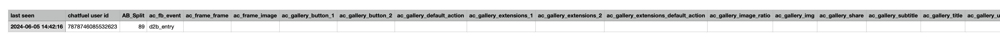

## 
This made me think about simulating event-based data myself. Because users interact with us only when we send them something, which happens 2-3 times per week, I can create an incremental table and write users’ attributes as an event, with the date of this event being the date when I pulled this data from Chatfuel. This approach wouldn’t allow me to use this event date in an incremental strategy, but it would create a historical data point that could be used in further analysis.

The table I’ll have at the end of the data transformation in the pipeline (made from the screenshot of the CSV file you saw earlier):

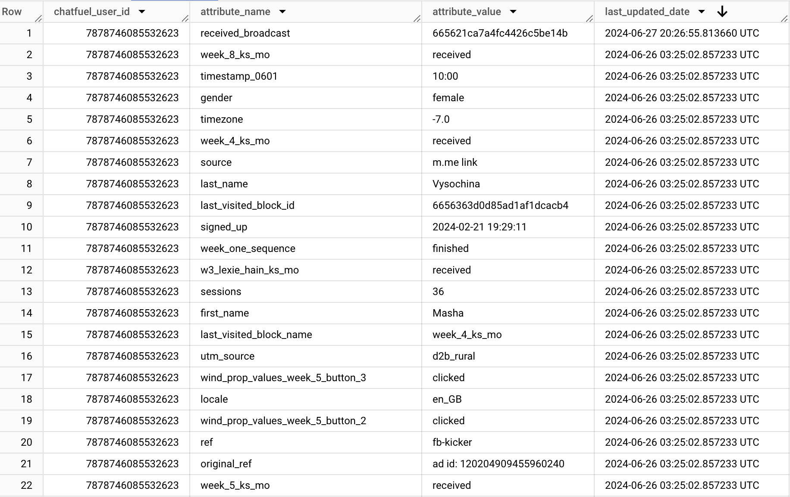  

      
## Use Cases

Populate the dashboard for stakeholders with high-level insights and KPIs. 

##

## Tech Stack

- **Docker container on a remote Ubuntu server:** Choose this setup for flexibility and fast testing of the pipeline. 
- **BigQuery:** Handles large datasets and supports complex queries efficiently.
- **DBT:** Facilitates data transformation and cleaning within BigQuery.
- **Airflow:** Manages workflow automation to ensure data pulls, transformations, and loads are executed daily.
- **Looker:** Provides advanced data visualization capabilities, integrating seamlessly with BigQuery to create dashboards.

Given the company's active use of GCP, the final dashboard is in Looker, using BigQuery as the backend. And there is a possibility of moving the pipeline from Docker and a remote Ubuntu server to Google Cloud Composer. 

##
## The Pipeline

### Airflow

Tl;dr - At some point while working on this pipeline, I realized that I have so many Python scripts and models, that I can’t remember what script does what, so I made this schema for myself, hopefully, it will help you to gain this understanding too.

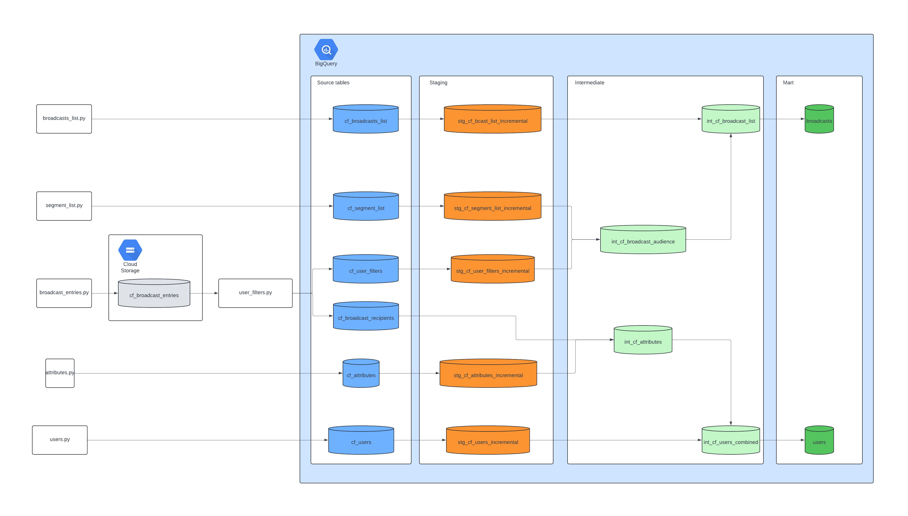

***All the BigQuery screenshots, that you will see later in this article contain my user data and data generated with the Faker library.***

##
### Data collection with Python scripts

The first step of the Airflow part is pulling and uploading the data from Chatfuel to BigQuery tables. 

Each Python script does basic cleaning and column renaming to ensure data integrity in BigQuery.

1. **users.py**: Sends the request to receive a list of users with system attribute values from Chatfuel and uploads them to BigQuery's `cf_users` table.

   The size of the table is over 500K rows.
    
    BigQuery Schema:
   
    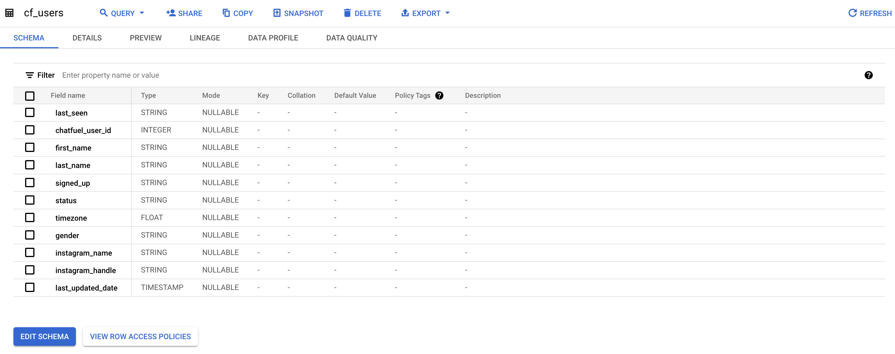
    
3. **attributes.py**: Fetches custom attributes, transforms the data into an events table, and uploads it to BigQuery's `cf_attributes` table.

   The size of the table is over 12 million rows.
    
    BigQuery Schema:
   
   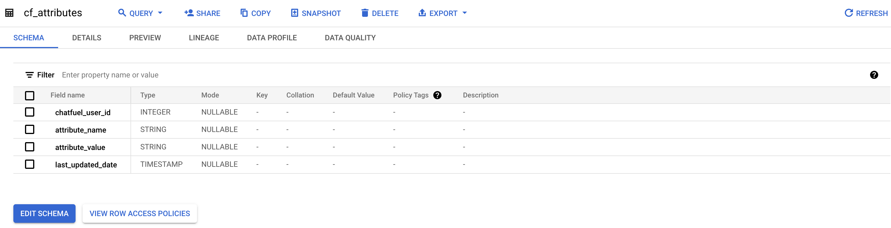

5. **broadcast_entries.py** and **broadcasts_list.py**: Collects broadcast lists and basic statistics, and uploads them to BigQuery `cf_broadcasts_list` table and Google Cloud Storage `cf_broadcast_entries` bucket.

   The size of the table is about 100 rows.
    
    BigQuery Schema:
   
   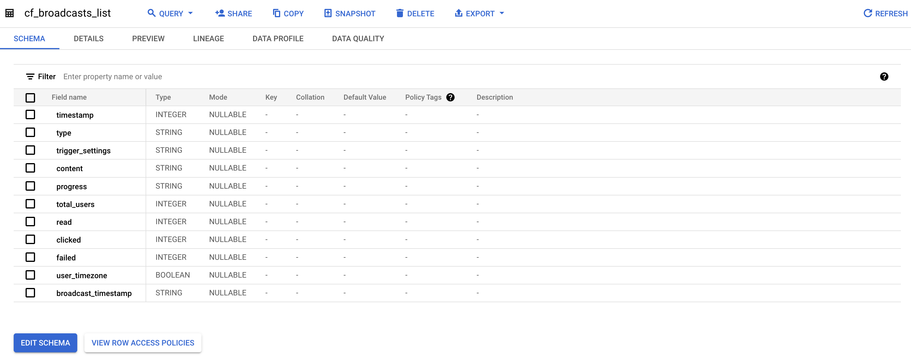

    cf_broadcast_entries example data:
   
   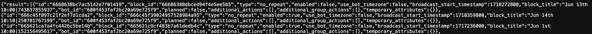

7. **user_filters.py**: Sends broadcast filters to Chatfuel, receives user IDs, and uploads them to BigQuery to `cf_user_filters table` and `cf_broadcast_recipients` table.
 
   The size of the `cf_user_filters table` is small and less than 100 rows, because we are collecting the data only for broadcasts that were sent in between 1 and 7 days ago.

   The size of the `cf_broadcast_recipients` is more than 50K rows on average.

    BigQuery Schema:
   
   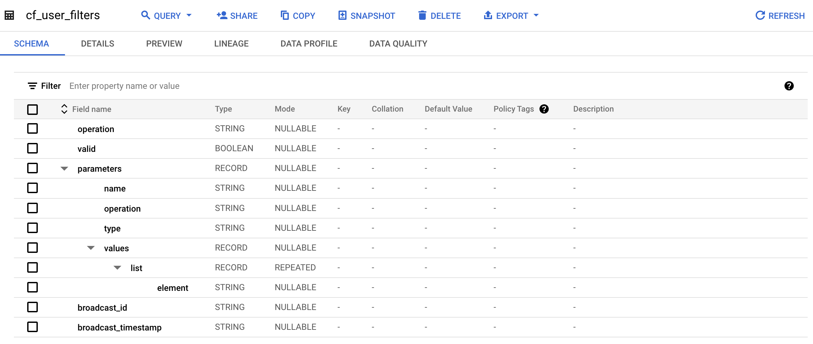

   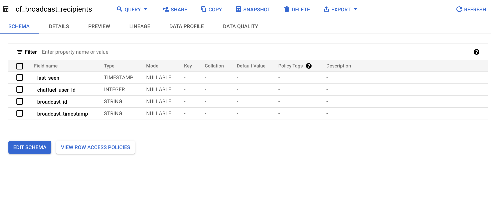

9. **segments_list.py**: Collects user segment IDs and names from Chatfuel, uploading them to BigQuery `cf_segment_list` table.

   The size of the table is about 500 rows.

     BigQuery Schema:
   
    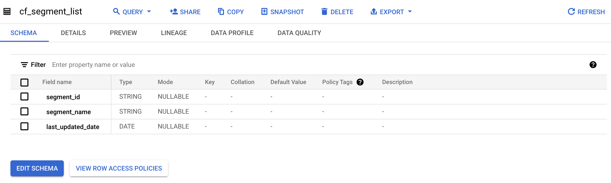

##
### Data Transformation with DBT in Bigquery

The second step is to transform the data and create tables with DBT.

I primarily use incremental tables for data transformation. Since Chatfuel's data isn't event-based, I added a `last_updated_date` column before uploading source tables to BigQuery.

##
#### **Staging Models:**

- **stg_cf_users_incremental**:
    - **Description:** An incremental table with a merge strategy. It takes data from the `cf_users` table and inserts a new row to `stg_cf_users_incremental` if a user is new or has changed their status from ‘reachable’ to ‘blocked’. This approach keeps historical records.
    - **Transformation Details:** The `cf_users` table is truncated after processing using a post-hook.
    - Schema:
      
      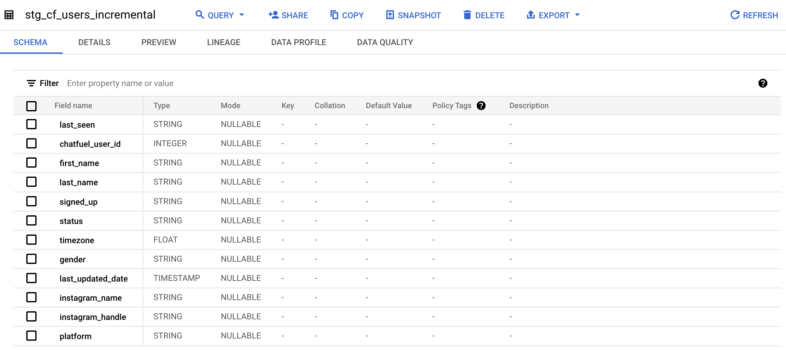
      
      The example of my user data:

      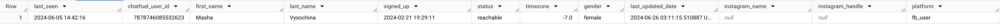

- **stg_cf_bcast_list_incremental**:
    - **Description:** An incremental table with a merge strategy. It takes data from the `cf_broadcast_list` table and inserts new rows or updates existing ones if broadcast metrics change.
    - **Transformation Details:** The `cf_broadcast_list` table is truncated after processing using a post-hook.
    - Schema:

       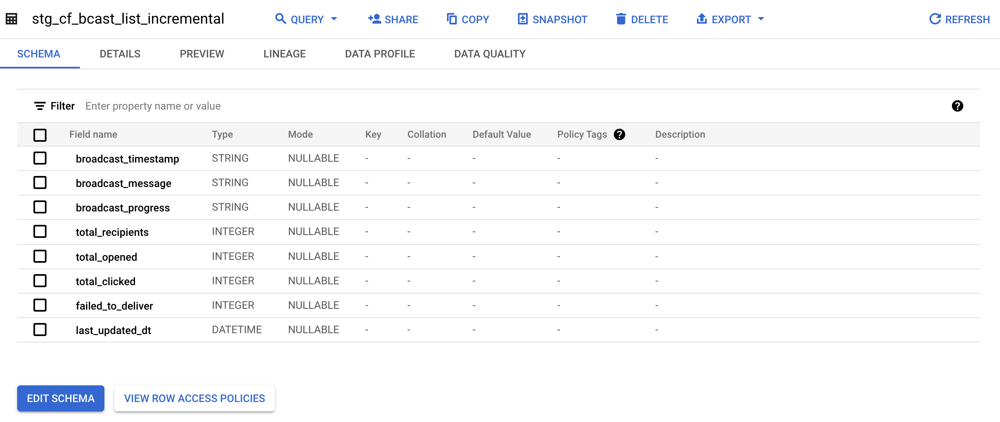

- **stg_cf_user_filters_incremental**:
    - **Description:** An incremental table with a merge strategy. It processes data from the `cf_user_filters` table and inserts new rows if filter details are new.
    - **Transformation Details:** The `cf_user_filters` table is truncated after processing using a post-hook.
    - Schema:

      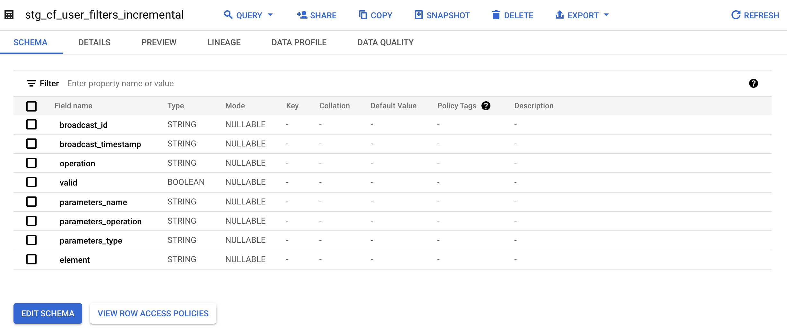
      
      The example of the data:

      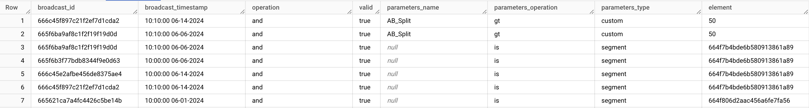

- **stg_cf_segment_list_incremental**:
    - **Description:** An incremental table with a merge strategy. It processes data from the `cf_segment_list` table, inserting new rows for new segments or updating existing ones if segment names change.
    - **Transformation Details:** The table `cf_segment_list` is truncated after processing using a post-hook.
    - Schema:
      
      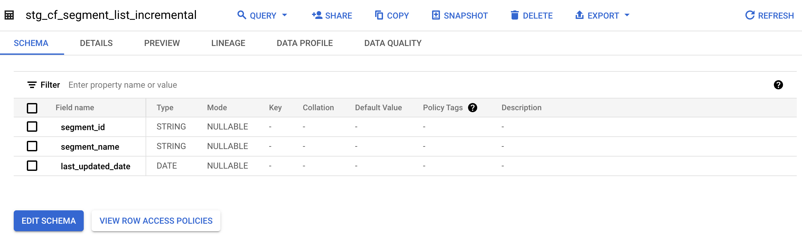

##
#### **Intermediate Models:**

- **int_cf_attributes**:
    - **Description:** Creates a materialized table combining data from `stg_cf_attributes_incremental` and `cf_broadcast_recipients` tables. It adds a `received_broadcast` event for users who received the last broadcast.
    - **Transformation Details:** Truncates the source `cf_broadcast_recipients` table after processing.
    - The example of the data with my user id:
      
      

- **int_cf_broadcast_audience**:
    - **Description:** An incremental table that merges data from `stg_cf_user_filters_incremental` and `stg_cf_segment_list_incremental`, providing a clear name for each broadcast's audience.
    - **Transformation Details:** Inserts new rows if audience filters are new.
    - The example of the data:
      
      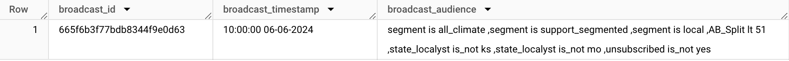

- **int_cf_broadcast_list**:
    - **Description:** An incremental table that joins `int_cf_broadcast_audience` and `stg_cf_bcast_list_incremental`, joining broadcast analysis with the audience name, that received the broadcast.
    - **Transformation Details:** Inserts new rows if broadcasts are new.
    - The example of the data:
      
      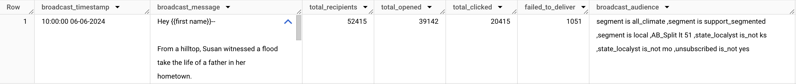

- **int_cf_users_combined**:
    - **Description:** A view combining `int_cf_attributes` and `stg_cf_users_incremental` for daily analysis of user behavior and counting the number of users in engagement buckets (lead, hot lead, advocate, hero) and number of users in the opinion buckets (support, on the fence, oppose).
    - **Transformation Details:** Inserts new rows daily.
    - Schema:
      
      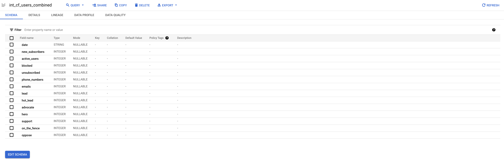

##
#### **Mart Models:**

- **broadcasts**:
    - **Description:** An incremental table providing final broadcast data that goes straight to the Looker Dashboard.
    - **Transformation Details:** Inserts new rows if broadcasts are new.
    - Example of the data, generated with the faker library:
      
      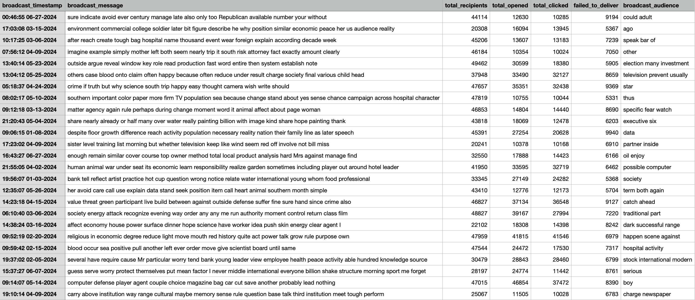

- **users**:
    - **Description:** An incremental table providing daily user analysis that goes straight to the Looker Dashboard
    - **Transformation Details:** Inserts new rows daily.
    - Example of the data, generated with the faker library:
      
      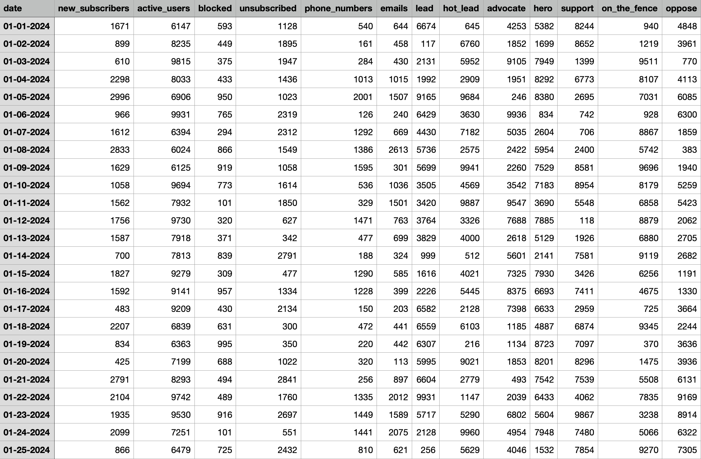

##
### Data tests with DBT

The last step of the Airflow DAG is to perform tests on the tables that have been created. Most of the time I use tests for unique and not_null values, sometimes it is accepted_values. 

To make the DAG look nice and clean I used @task_group decorator.

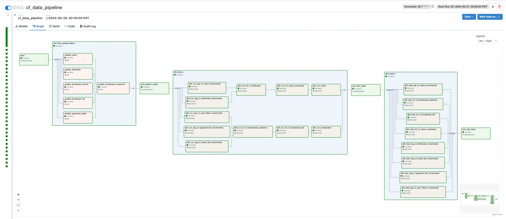

I scheduled the DAG to run every day at 12:30 AM and this final version has been running since June 25. I’ve encountered a couple of errors with the DBT jobs part, that also influenced DBT tests, but we are here to learn how to fix it, right? In both cases, it happened because I changed the date field in the Python script, which made me learn to pay close attention to timestamps and how to handle different date and time formats.

##

### Visualization in Looker

The final step of the pipeline is the Looker dashboard, which provides a bird-eye view of how we are doing daily.

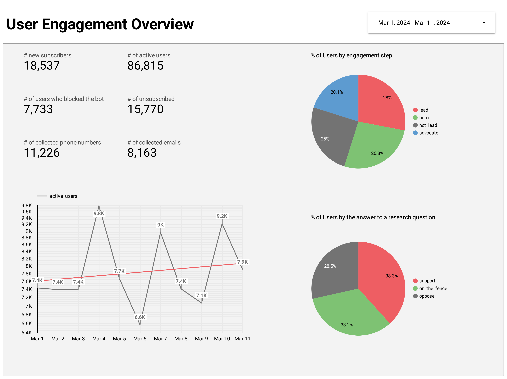

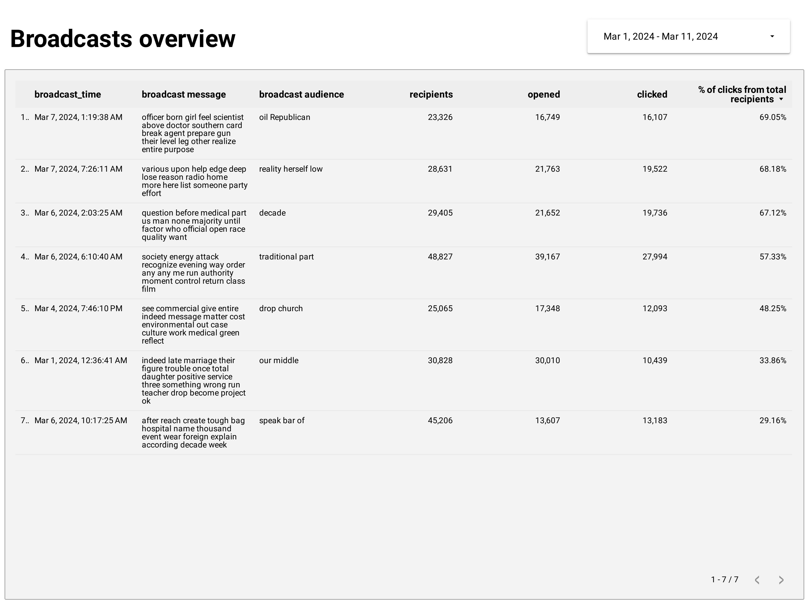

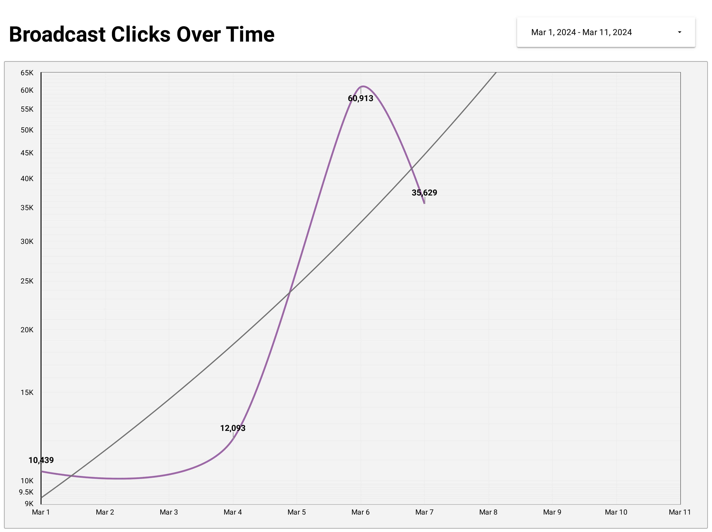

##

## Alternatives and Scaling Opportunities

- **Serverless vs. Server-Based:** For now, I choose to run the pipeline on a remote Ubuntu server with Docker, but there is a possibility to move the project to the Google Cloud Composer to simplify the orchestration, given that I'm the only DE in the team.

- **Scalability:** If the batch size increased by 100x, the current setup with BigQuery and Airflow would still be able to handle the load due to their scalability. However, we would need to optimize query performance and possibly increase resource allocation. But I'm not sure that Chatfuel will handle 100x.

- **Real-Time Data:** If one of the sources were a streaming source, we could integrate tools like Apache Kafka or Google Pub/Sub to handle real-time data ingestion. This would require modifications to the current batch processing pipeline to accommodate continuous data flow.

##

## What's next?

- **Data Quality Checks:** Implementing additional data quality checks using the Great Expectations framework. I already tried to do some basic tests here and really want to implement them into the pipeline.
- **Additional Data Collection:** Adding another Python script to collect data per broadcast from Chatfuel for more granular analysis.
- **Enhanced Analytics:** Expanding the Looker dashboard to include more detailed analytics and insights.
- **Add the DAG for the data from Mailchimp**. As Mailchimp data is event-based and can be collected with APIs, I believe it wouldn’t be harder than Chatfuel.

##
## Conclusion

This project was a challenging yet rewarding experience, where I had to design and implement a complex data pipeline from scratch, integrating multiple data sources and utilizing various modern data engineering tools. Key accomplishments include:

- Reverse-engineering Chatfuel's GraphQL database for data extraction.
- Moving from a serverless to a server-based architecture for better control and reliability.
- Implementing incremental data transformation and cleaning strategies to maintain historical data integrity.
- Automating workflows with Airflow and using DBT for data transformation to ensure timely and accurate data processing.
- Creating a Looker dashboard that provides actionable insights, helping the company to make informed decisions in promoting renewable energy.

Through this project, I gained valuable experience and improved my problem-solving skills, technical proficiency, and adaptability in handling complex requirements and constraints.

